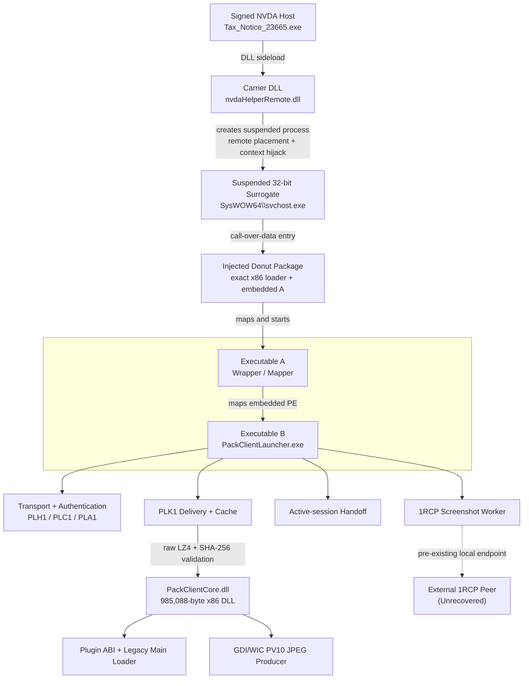

# PackClient

#### Reverse Engineering a Modular RAT Framework

<p align="center">  
&nbsp;&nbsp;&nbsp;  </p>

From Launcher to recovered Core: A technical teardown of PackClient’s PLK1 delivery, plugin loading, screen-capture paths, persistence, and historical C2 traffic.

<p align="center">
  <a href="https://ivanimmanuel-dev.github.io/PackClient/">Read the Publication</a>
  &nbsp;·&nbsp;
  <a href="https://ivanimmanuel-dev.github.io/PackClient/PackClient.pdf">Download the PDF</a>
</p>

## Findings

- Reconstruction of the worker-side `1RCP` interface: a 20-byte header, four message types, and top-down BGRX framebuffer data.
- Recovered transport and authentication contracts: outer framing, the handshake, HMAC verification before AES-CBC decryption, and the PLK1 cache-validation path.
- Recovered a 985,088-byte x86 `PackClientCore.dll` directly from historical PLK1 traffic.
- Reassembled a complete historical `PLH1 -> PLC1 -> PLA1 -> PLK1` session, followed by bidirectional Core traffic and 15 `PV10` JPEG frames.
- Identified the signed host’s carrier export, the injected Donut package and terminal-loader ABI, the Core’s modern and legacy plugin-loading contracts, and its built-in `PV10` producer.
- Mapped all 11 Core exports, the Launcher-to-Core ABI, six local settings, the Core-specific type-`0x16` encryption layer, staged plugin delivery and cache logic, DPAPI-protected Core-update storage, ETCHOOK clipboard replacement, and the main command handlers.
- Runtime separation of two persistence paths: normal full-EXE execution persists `Tax_Notice_23665.exe`, while direct-DLL execution produces a broken `rundll32.exe` task without the original DLL argument.

## Recovered architecture



## References

| Topic | Reference |
|---|---|
| Execution chain and recovered components | [Launcher architecture](docs/launcher-architecture.md) |
| `1RCP` screenshot protocol and framebuffer | [Screenshot IPC](docs/screenshot-ipc.md) |
| Benign local peer/simulator | [Synthetic IPC Validation](docs/screenshot-ipc-validation.md) |
| Network framing, authentication and PLK1 | [Launcher protocol](docs/launcher-protocol.md) |
| Core recovery and runtime behavior | [Core Analysis](docs/core-analysis.md) |
| Windows session handoff | [Active-session Handoff](docs/active-session-handoff.md) |
| Runtime memory, persistence and networking | [Runtime analysis](docs/runtime-analysis.md) |
| Evidence, identities and scope | [Evidence](docs/evidence.md) |
| Known gaps and limitations | [Limitations](docs/limitations.md) |
| Passive protocol-analysis tools | [Tooling](docs/tooling.md) |
| Detection engineering | [Detection Guide](docs/detection-guide.md) |

## Tools

| Interface | Purpose |
|---|---|
| `tools/packclient_decode.py` | Decode supplied raw streams into structured JSON |
| `tools/packclient_pcap_decode.py` | Decode supplied PCAP/PCAPNG into per-flow timelines |
| `tools/wireshark/packclient.lua` | Display protocol metadata in Wireshark/TShark |

The Python CLIs require Python 3.11–3.13 and the standard library. LZ4 support and detection-engine tests have separate pinned optional dependencies. [The quickstart](docs/tooling.md#minimal-example) creates a deterministic synthetic input without any malware.

```sh
python -B -m unittest discover -s tests -v
```

The optional [synthetic IPC kit](docs/screenshot-ipc-validation.md) exercises the reconstructed `1RCP` contract using benign deterministic inputs and outputs, without malware or desktop capture.

## Detection

The Sigma, Suricata and YARA rules are included as experimental detection candidates with regression coverage. Production accuracy has not been measured.

## Scope and Limitations

The available evidence does not identify the external `1RCP` peer, contain a delivered plugin binary, prove a bridge between `1RCP` and Core `PV10`, recover the server implementation, establish a complete real `1RCP` exchange, or prove the causal diagnosis of the worker failure.

Additional reproducibility gaps are documented in [Evidence](docs/evidence.md) and [Limitations](docs/limitations.md).

## Prior Work

PackClient was previously documented by Proofpoint and Deception.Pro. This work adds implementation details from the analyzed carrier and Launcher, and recovered Core. See [Prior Work](docs/prior-work.md) for more details.

## Citation

Use [CITATION.cff](CITATION.cff) to cite the report. 

Research cut-off: 9 September 2026.

Updated publication date: 9 September 2026.
