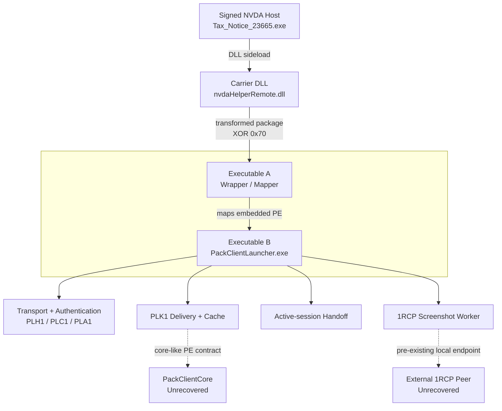

# PackClient

#### Reverse Engineering a Modular RAT Framework

<p align="center">  
&nbsp;&nbsp;&nbsp;  </p>

Reconstruction of the launcher's `1RCP` screenshot-worker protocol, transport, authentication, PLK1 delivery/cache behavior, active-session handoff, and runtime evidence tied to the recovered build.

<p align="center">
  <a href="https://ivanimmanuel-dev.github.io/PackClient/">Read the Publication</a>
  &nbsp;·&nbsp;
  <a href="https://ivanimmanuel-dev.github.io/PackClient/PackClient.pdf">Download the PDF</a>
</p>

## Findings

- Reconstruction of the worker-side `1RCP` interface: a 20-byte header, four message types, top-down BGRX framebuffer data, and an external endpoint peer.
- Recovered transport and authentication contracts: outer framing, handshake, authenticated AES-CBC receive ordering, and the PLK1 cache acceptance path.
- Runtime correspondence between the reconstructed launcher and private mappings, persistence, and attempted connectivity in evidence sets.
- Three passive tool interfaces, a benign `1RCP` peer/simulator kit, synthetic tests, and experimental detection candidates.

## Recovered architecture



## References

| Topic | Reference |
|---|---|
| Host, carrier, package and recovered components | [Architecture](docs/architecture.md) |
| `1RCP` screenshot protocol and framebuffer | [Screenshot IPC](docs/screenshot-ipc.md) |
| Benign local peer/simulator | [Synthetic IPC validation](docs/screenshot-ipc-validation.md) |
| Framing, handshake, encryption and PLK1 | [Protocol](docs/protocol-reference.md) |
| Token selection and session drift | [Active-session Handoff](docs/active-session-handoff.md) |
| Runtime memory, persistence and network observations | [Runtime](docs/runtime-validation.md) |
| Artifact identities and claim boundaries | [Evidence](docs/evidence.md) |
| Research limitations | [Limitations](docs/limitations.md) |
| Passive decoders | [Tooling](docs/tooling.md) |
| Detection candidates | [Detection Guide](docs/detection-guide.md) |

## Tools

| Interface | Purpose |
|---|---|
| `tools/packclient_decode.py` | Decode supplied raw streams into structured JSON |
| `tools/packclient_pcap_decode.py` | Decode supplied PCAP/PCAPNG into per-flow timelines |
| `tools/wireshark/packclient.lua` | Display protocol metadata in Wireshark/TShark |

The Python CLIs require Python 3.11–3.13 and the standard library. LZ4 support and detection-engine tests have separate pinned optional dependencies. [The quickstart](docs/tooling.md#minimal-example) creates a deterministic synthetic input without any malware.

```sh
python -B -m unittest discover -s tests -v
```

The optional [synthetic IPC kit](docs/screenshot-ipc-validation.md) exercises the reconstructed `1RCP` contract using benign deterministic inputs and outputs, without malware or desktop capture.

## Detection

The Sigma, Suricata and YARA rules are included as experimental detection candidates with regression coverage. Production accuracy has not been measured.

## Scope and Limitations

The available evidence does not establish a recovered Core, the external `1RCP` peer's identity, successful C2, a complete real `1RCP` exchange, the exact upstream injection subtype, envelope-key initialization, or the causal diagnosis of the worker failure.

Additional reproducibility gaps are documented in [Evidence](docs/evidence.md) and [Limitations](docs/limitations.md).

## Prior Work

PackClient was previously documented by Proofpoint. This work focuses on implementation details of the recovered launcher build. See [Prior Work](docs/prior-work.md) for more details.

## Citation

Use [CITATION.cff](CITATION.cff) to cite the report. 

Research cut-off: 5 September 2026. 

Publication date: 6 September 2026.
